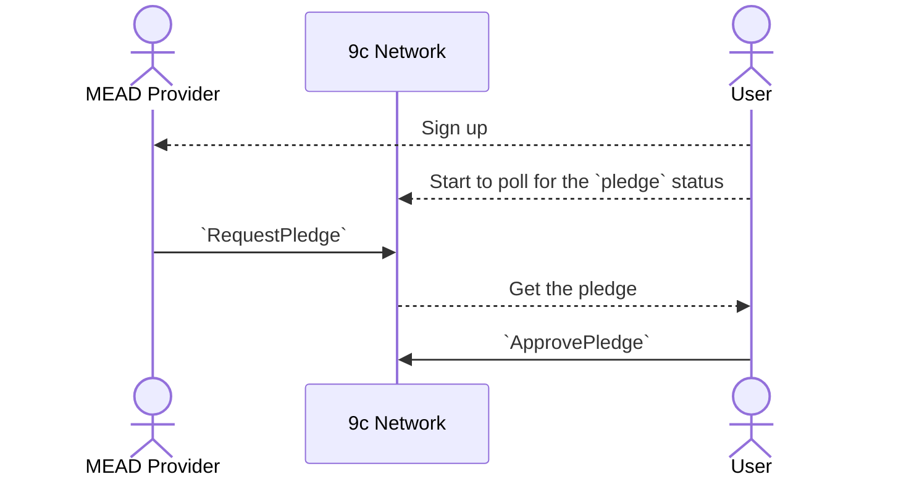
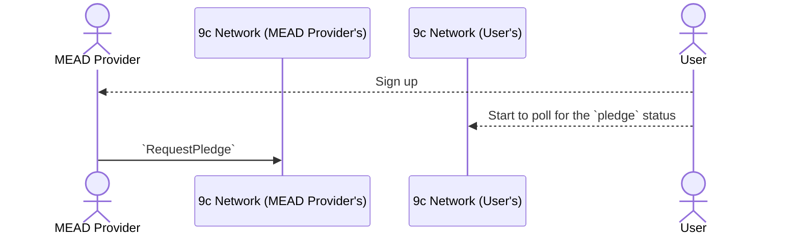
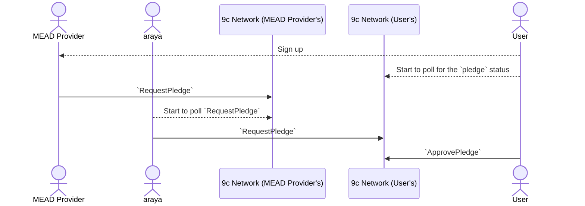
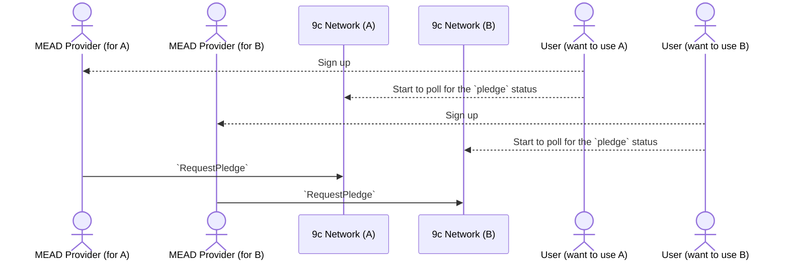

# Experimental MEAD Pledging Replicator

Note: At first of all, check [NCIP-15] if you aren't familiar with the concepts,
like MEAD or Pledge.

[NCIP-15]: https://github.com/planetarium/NCIPs/blob/main/NCIP/ncip-15.md

## Motivation

When MEAD Provider and users use the same network, pledging sequence would be
like as below.

But if we want to use the new network for certain users and don't want to modify
the client and MEAD Provider's code, we need a sort of trick.

In that case, araya has been proposed as a relayer/duplicator for pledges.
araya listens to all `RequestPledge` actions on a specific network and replicate
them to the other network.

In the above case, `RequestPledge` on `9c Network (MEAD Provider)` will not be
approve and araya can't replicate since it doesn't know User's private key.

### v. Dedicated MEAD Provider

Above problem can be solved without araya, if we're running multiple dedicated
MEAD Provider per each network.

This approach seems quite simple and makes sense. but it would be quite messy if
we want to keep current client implementation and UX flows.

### v. Rollup Proposer

Also, araya seems a just centralized/simplified rollup proposer and it might be
developed as a general purpose proposer.

However, since we are currently trying various approaches to multi-chain
strategies, it may be a hasty generalization to generalize to cover all cases.
therefore first of all, this project will focus only on solving the MEAD
pledging problem. (it's why this project is "experimental" yet)

## Prerequisites

- Node.js v19.7.0+
- yarn 1.22.15+
